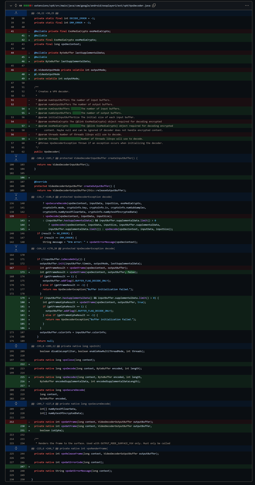
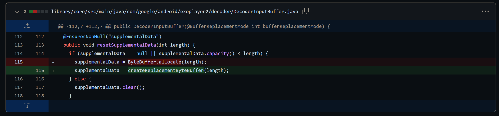
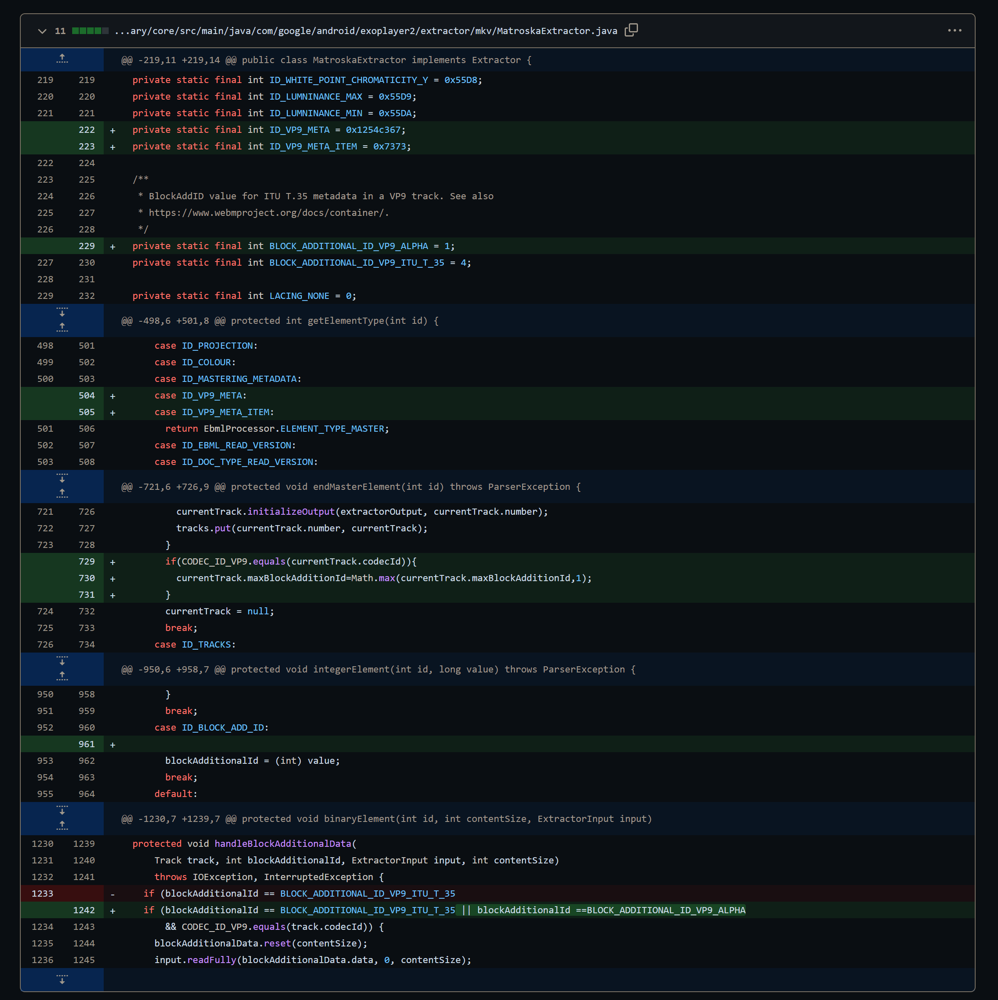
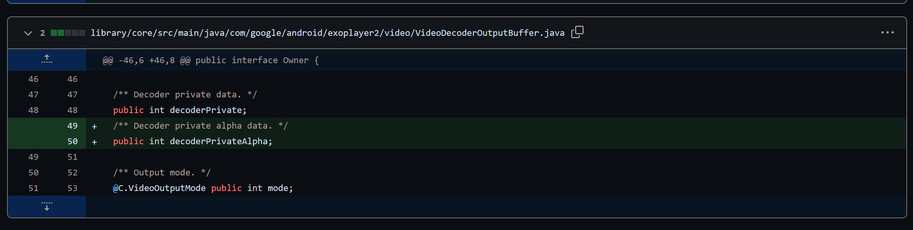
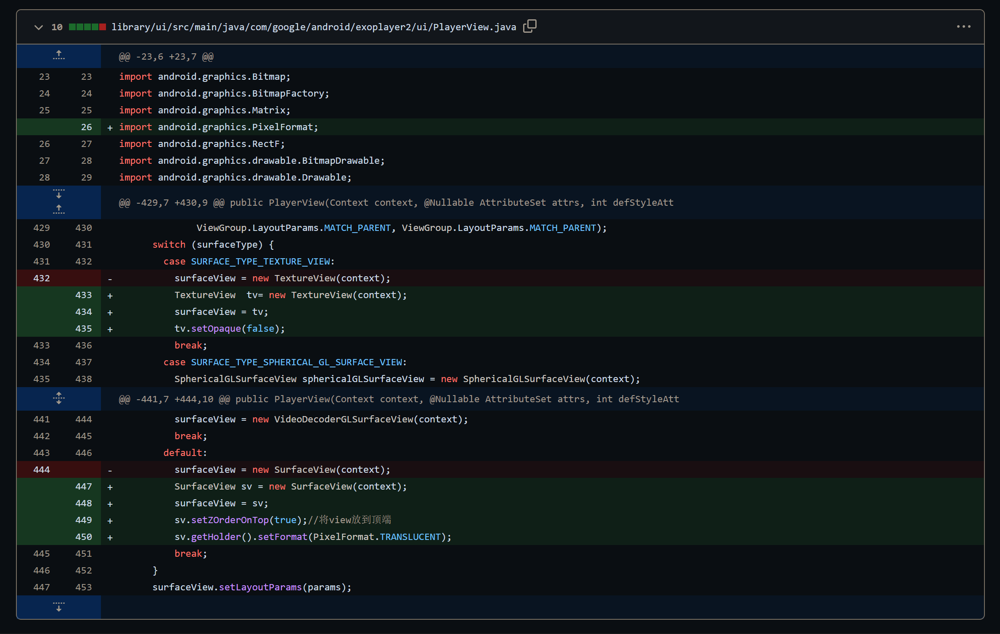

> 只有exoplayer的vp9模块才能支持透明视频播放，原始的v1.8.0版本不直接支持透明视频播放，需要更改c++以及java原生库的代码才能支持播放，项目根据github库修改，[vp9透明视频播放器demo](https://github.com/zxzx74147/ExoPlayer)这个库最高支持版本为sdk29版本，需要更新到29版本以上的需要按照以下规则更新exoplayer的播放库。
> 
> 项目基于[GoogleExoplayer](https://github.com/google/ExoPlayer)修改，exoplayer-v2.19.1版本的vp9建议支持的版本为1.8.0，即为[vp9透明视频播放器demo](https://github.com/zxzx74147/ExoPlayer)这个库的vp9编译版本，如果超过这个版本，需要根据[这个库的提交日志修改对应的c++代码java代码然后编译打包](https://github.com/google/ExoPlayer/compare/release-v2...zxzx74147:ExoPlayer:dev-v2-r2.11.8-transparency)

## 方法步骤：

1. clone最新的[GoogleExoplayer](https://github.com/google/ExoPlayer)的代码，把library/ui下的java跟res代码复制到exoplayer项目文件夹对应位置，复制library/core以及core相关的project的java代码、res资源等合并。
2. 修改**extensions/vp9/src/main/java/com/google/android/exoplayer2/ext/vp9/VpxDecoder.java**
   
   
3. 修改**library/core/src/main/java/com/google/android/exoplayer2/decoder/DecoderInputBuffer.java**
   
   
4. 修改**library/core/src/main/java/com/google/android/exoplayer2/extractor/mkv/MatroskaExtractor.java**
   
   
5. 修改**library/core/src/main/java/com/google/android/exoplayer2/video/VideoDecoderOutputBuffer.java**
   
   
6. 修改**library/ui/src/main/java/com/google/android/exoplayer2/ui/PlayerView.java**
   
   
7. 修改完成！！